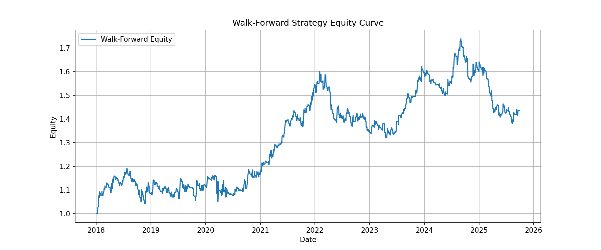
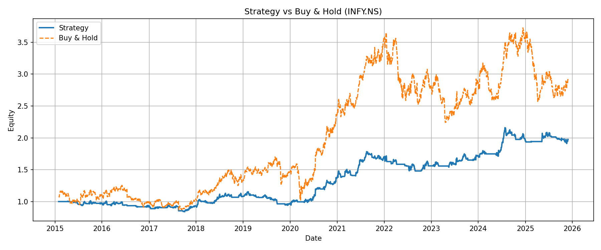
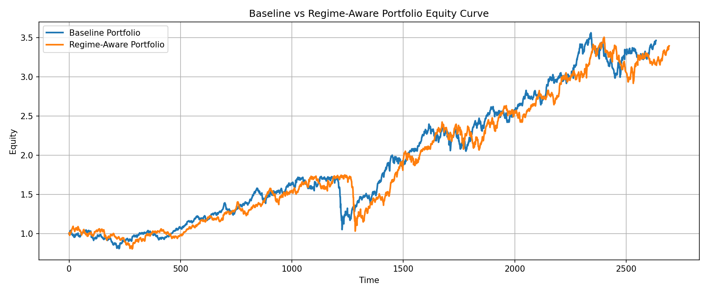
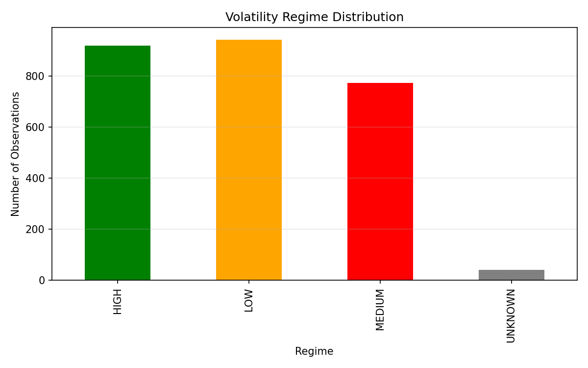
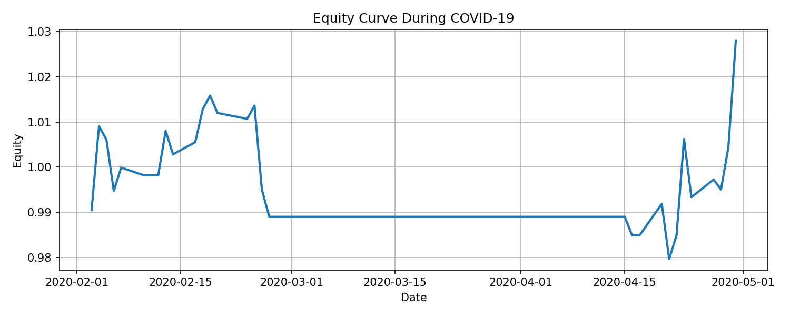
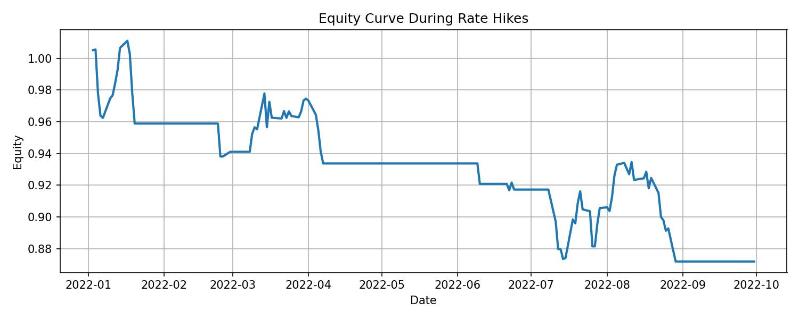

# Quant Volatility & Risk Engine  

**Tech Stack:** Python 3.11  
**Domain:** Quantitative Finance  
**Status:** Research Complete  

🔗 Python: https://www.python.org  
🔗 Project Repo: https://github.com/sidharth-choudhary786/quant-volatility-risk-engine


## Quick Start

### Create virtual environment
```bash
python3.11 -m venv venv

# macOS / Linux
source venv/bin/activate   

# Windows
venv\Scripts\activate
```
### Install dependencies
```bash
pip install -r requirements.txt
```
### Run entire project
```bash
python -m run.run_full_pipeline
```
> The entire pipeline executes end-to-end with no manual intervention.


## Research Context

This project grew out of a frustration I kept running into while reviewing
quantitative finance projects: impressive headline numbers, but very little
attention to research discipline, robustness, or failure analysis.

The goal here is not to optimize metrics or chase Sharpe ratios, but to
design a system that:
- behaves correctly out-of-sample
- remains interpretable across regimes
- exposes failure modes instead of hiding them

This context informs every design decision in the pipeline.


## Who This Project Is For

- MSc / MTech / PhD students working on quantitative finance projects  
- Candidates preparing for quant research or trading interviews  
- Researchers interested in volatility modeling and regime-aware systems  
- Engineers and students interested in how professional quantitative research pipelines are structured


## How to Review This Project (Recommended)

If you are short on time:

1. Run the pipeline with one command
2. Look at `outputs/charts/`
3. Check `portfolio_comparison.csv`
4. Read the Diagnostics section

This gives a complete picture in under 10 minutes.


## Why This Project Matters

This project intentionally prioritizes:
- robustness over curve-fitting
- interpretability over opaque optimization
- failure analysis over headline metrics

These priorities come with trade-offs, and the results reflect that.


## What Makes This Project Different

- Fully automated end-to-end pipeline (one command)
- Rolling walk-forward evaluation (no look-ahead bias)
- Explicit regime-aware logic (not hidden ML)
- Portfolio-level risk controls (VaR, ES, stress tests)
- Diagnostics-first mindset (failure analysis, not just returns)


## How This Project Should Be Read

This repository is not meant to be skimmed like a typical trading strategy.

It is structured to show **how decisions are made**, not just what the final metrics are.

If you are reviewing this as:
- a researcher → focus on walk-forward logic and diagnostics
- an interviewer → focus on design decisions and failure analysis
- an engineer → focus on modularity and reproducibility

The results matter, but understanding *why they look the way they do*
matters more.


## Key Design Decisions

Some deliberate choices shaped this system:

- Walk-forward evaluation is used instead of static splits to reflect how models are deployed in practice.
- Regime logic is rule-based and observable, avoiding opaque decision boundaries.
- Risk controls operate at the portfolio level, not as post-processing filters.
- Diagnostics are treated as first-class outputs, not optional analysis.

These decisions trade raw performance for interpretability and robustness.


## Technical Overview

### 1. What this project is about (in simple words)
The entire research pipeline is fully automated and reproducible.

Instead of focusing on “high returns”, the goal is to build a system that is:

- statistically sound  
- free from look-ahead bias  
- robust across market regimes  
- transparent and diagnosable  


### 2. Key ideas implemented

#### Volatility modeling
- GARCH, GJR-GARCH, EGARCH, FIGARCH

#### Research discipline
- Rolling walk-forward re-fitting  
- Dynamic model selection  
- Strict train → test separation  
- No data leakage  

#### Strategy logic
- Volatility targeting  
- Volatility regime detection (LOW / MEDIUM / HIGH)  
- Risk-adjusted signal: Expected Return ÷ Forecasted Volatility  

#### Portfolio & risk
- Inverse-volatility weighted portfolios  
- Regime-aware portfolio allocation  
- Portfolio-level VaR & Expected Shortfall constraints  
- Stress testing (COVID-19, rate-hike regimes)  
- Capital allocation checks  

#### Diagnostics
- Regime-wise performance attribution  
- Risk allocator behavior analysis  
- Crisis-specific drawdown analysis  
- Visual equity curves for interpretation  


### 3. Project structure (clean & modular)

```
quant-volatility-risk-engine/
│
├── backtest/              # Single asset & portfolio backtests
├── walkforward/           # Rolling walk-forward framework
├── models/                # GARCH family models
├── model_switching/       # Dynamic model selection
├── regime/                # Volatility regime logic
├── risk/                  # VaR, ES, stress testing
├── risk_allocator/        # Risk-constrained scaling
├── strategy/              # Signals & position sizing
├── diagnostics/           # Research diagnostics
├── scripts/               # Data preprocessing & runners
├── run/                   # One-command pipeline runner
├── tests/                 # Sanity checks
├── outputs/
│   ├── final/             # CSV results
│   └── charts/            # All plots
└── README.md
```

---

### 4. Environment setup (macOS example)
This section shows a macOS/Homebrew setup.  
Other platforms can use any Python 3.11 installation.

#### Step 1: Install Python (macOS / Linux)

```bash
brew install python@3.11
/opt/homebrew/bin/python3.11 --version
```

Expected:
```
Python 3.11.x
```


#### Step 2: Create virtual environment

```bash
/opt/homebrew/bin/python3.11 -m venv venv
source venv/bin/activate
```

> Always use a fresh virtual environment.


#### Step 3: Install dependencies

```bash
pip install --upgrade pip
pip install -r requirements.txt
```

---

### 5. One-command execution (FULL PIPELINE)

Once setup is done, **everything runs with one command**:

```bash
python -m run.run_full_pipeline
```

This single command executes:

1. Data preprocessing  
2. Rolling walk-forward modeling  
3. Walk-forward evaluation + equity plot  
4. Single-asset strategy backtest  
5. Baseline portfolio backtest  
6. Regime-aware portfolio + risk allocator  
7. Portfolio comparison  
8. VaR & Expected Shortfall  
9. Stress testing & capital allocation  
10. Full diagnostics + plots  

No manual steps. No hidden scripts.

---
### 6. Outputs & Artifacts

All outputs are saved under the `outputs/` directory and represent final
research results produced by the pipeline.

#### 6.1 Research Tables (CSV)

Location: `outputs/final/`

- walk-forward evaluation metrics  
- single asset performance results  
- baseline portfolio metrics  
- regime-aware portfolio metrics  
- portfolio comparison results  
- VaR and Expected Shortfall summaries  
- stress testing outputs  
- capital allocation results  
- additional diagnostic tables (regime and allocator behavior)

Examples:
- walkforward_metrics.csv
- portfolio_regime_metrics.csv
- portfolio_comparison.csv

#### 6.2 Visual Diagnostics (Plots)

Location: `outputs/charts/`

- walk-forward equity curve  
- single asset equity curve  
- baseline vs regime-aware portfolio equity  
- volatility regime distribution  
- crisis-period equity curves (COVID-19, rate hikes)


### 6.3 Visual Results (Key Plots)

The following plots are automatically generated by the pipeline and
summarize the behavior of the system visually:

#### Walk-Forward Equity Curve


#### Single Asset Strategy Equity


#### Baseline vs Regime-Aware Portfolio


#### Volatility Regime Distribution


#### Crisis Period Performance
**COVID-19**


**Rate Hike Regime**



### 7. Diagnostics philosophy

Many quantitative projects stop at reporting Sharpe ratios and moving on.

This project focuses on understanding *behavior* rather than optimizing metrics.
Diagnostics are used to answer practical research questions:

- When does the strategy underperform?
- Which volatility regimes contribute most to drawdowns?
- Does the risk allocator actually activate, and when?
- How does the system behave during real market crises?

These diagnostics follow standard practices used in professional quantitative research.

---

### 8. How Good Are the Results? (Honest Assessment)

The results are reasonable and internally consistent rather than aggressively optimized for in-sample performance.
Performance naturally decreases as evaluation constraints become stricter, which is consistent with robust out-of-sample testing.

At the portfolio level, adding regime awareness improves overall
risk-adjusted behavior, mainly by reducing drawdowns during high
volatility periods. Risk is managed, but not removed, which aligns with
how real trading systems behave.

Overall, the outcomes are believable and reflect realistic performance
for volatility- and regime-based strategies.


### 9. Academic & industry level

This project aligns with expectations for:

- **Strong MSc / MTech final project**
- **Early PhD-level research prototype**
- **Quant research internship / analyst portfolio**

It is **far above**:
- Indicator-based trading bots  
- Static backtests  
- ML-for-the-sake-of-ML projects  

### 10. Skills Demonstrated

- Time-series modeling and volatility forecasting
- Walk-forward experimental design
- Portfolio-level risk measurement (VaR, ES)
- Diagnostic-driven research evaluation
- Reproducible research pipelines


### 11. Disclaimer

This project documents how I think about quantitative systems under uncertainty:
explicit assumptions, controlled experimentation, and honest evaluation when
results are uncomfortable.


### 12. Author

Designed and implemented end-to-end as a personal quantitative research system.

**Connect with me:**
- GitHub: https://github.com/sidharth-choudhary786
- LinkedIn: https://www.linkedin.com/in/sidharth-choudhary786
- Projects: https://github.com/sidharth-choudhary786?tab=repositories

